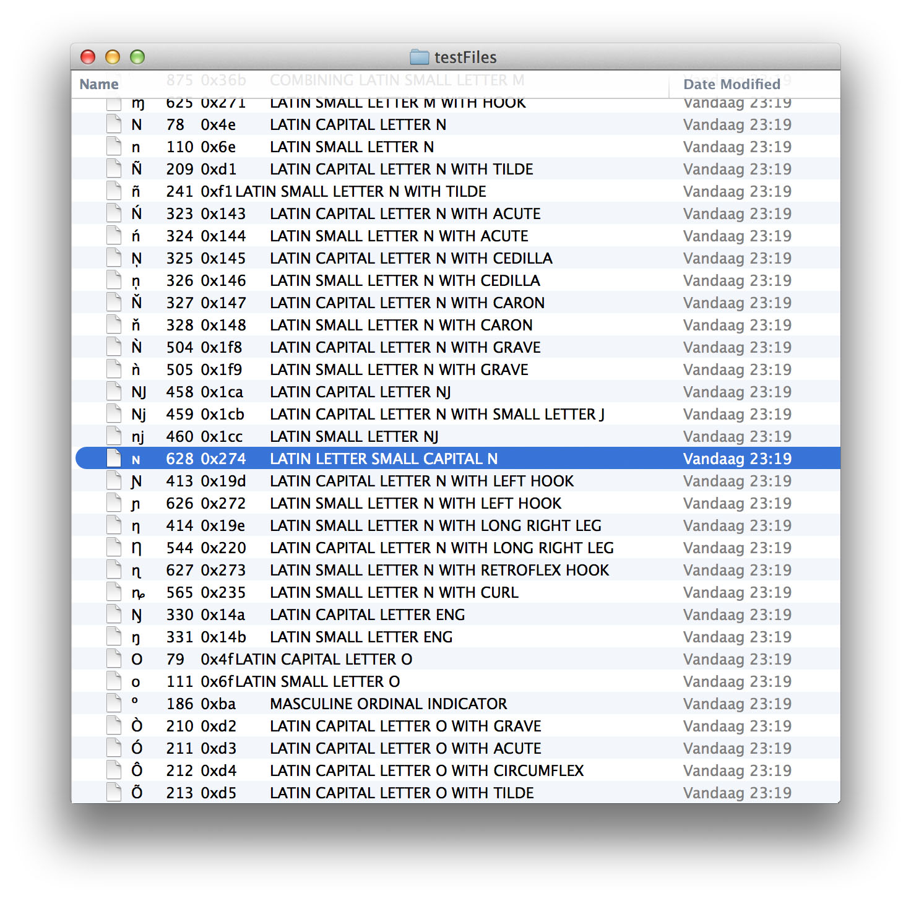

fileSystemSortOrder
===================

Python script that generates a folder with a series of files, each filename starting with a different unicode character. This can be used as a simple diagnostic tool to establish the local file system's preferred sorting algorithm.

Note: if you make a lot of files you might run into an implementation limit. 

